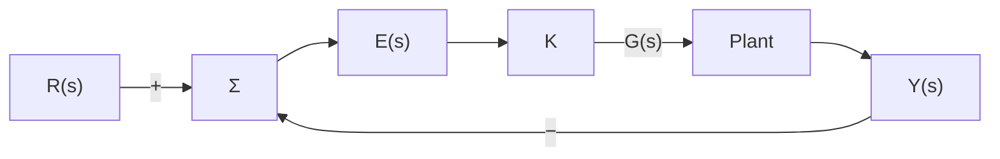

# Root Locus Introduction

Root locus is a graphical method used in control systems to show how the closed-loop poles of a feedback system move in the complex s-plane as the loop gain K changes. It helps determine stability, transient response, and how the system behaves for different values of controller gain.

---

## Definition

For a unity-feedback system with open-loop transfer function G(s), the root locus is the set of points s in the complex plane that satisfy the characteristic equation as the gain K varies from 0 to ∞.

---

## Block Diagram

- **R(s)** = reference input
- **E(s)** = error signal
- **K** = controller gain
- **G(s)** = plant transfer function
- Feedback is unity, so the output Y(s) is fed back directly.

---

## Closed-Loop Transfer Function

For the standard unity-feedback system with open-loop transfer function K G(s), the closed-loop transfer function is:

$$T(s) = \frac{Y(s)}{R(s)} = \frac{K\times G(s)}{1 + K\times G(s)}$$

If we express G(s) as a ratio of numerator and denominator,

$$G(s) = \frac{N(s)}{D(s)}$$

then the closed-loop transfer function becomes:

$$T(s) = \frac{K\times N(s)}{D(s) + K\times N(s)}$$

---

## Characteristic Equation

The characteristic equation is the denominator of T(s) set to zero:

$$1 + K\times G(s) = 0$$

Using G(s) = N(s)/D(s), this becomes:

$$D(s) + K\times N(s) = 0$$

This is the equation used to plot the root locus and to determine the closed-loop pole locations as K changes.

