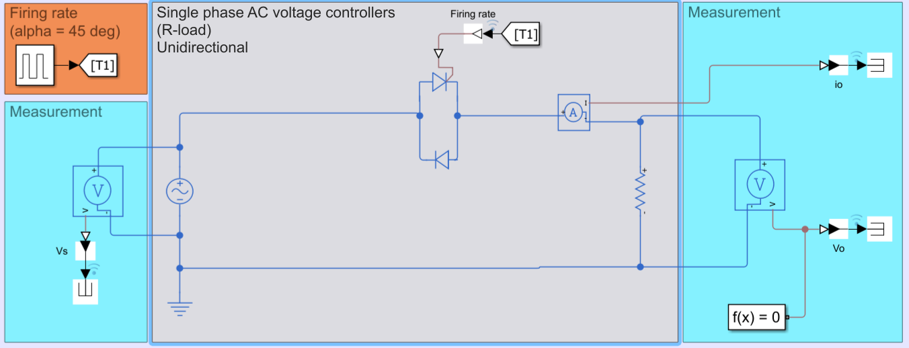
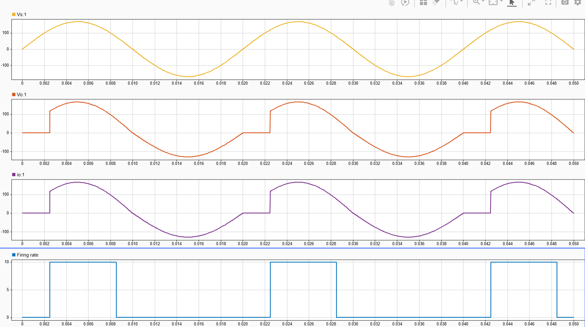
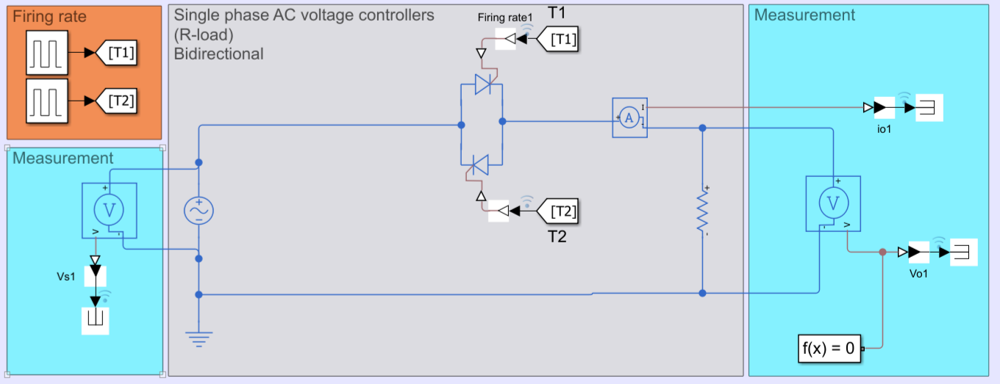
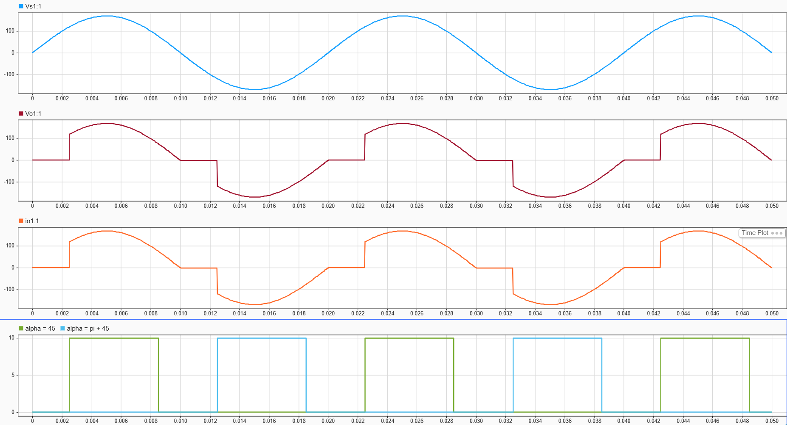
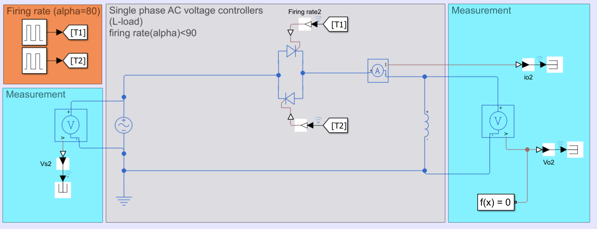
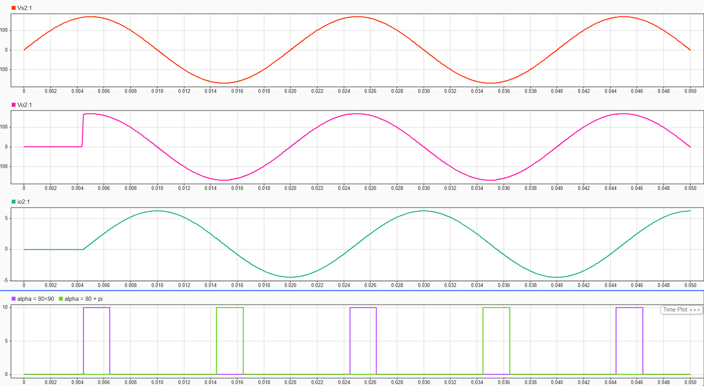
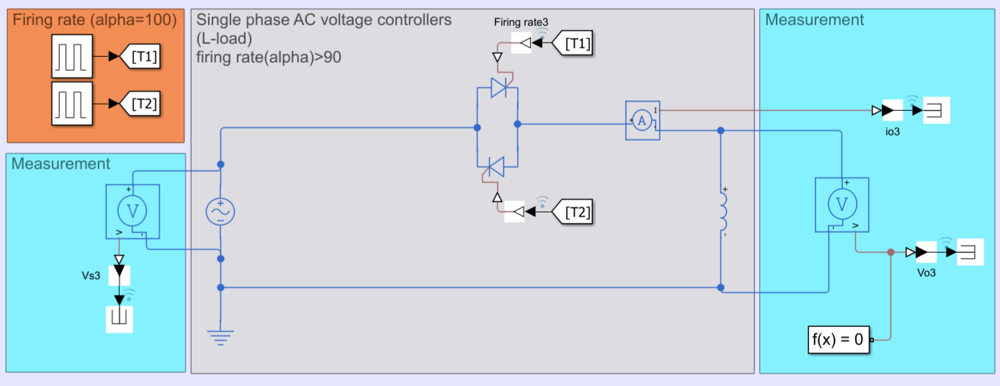
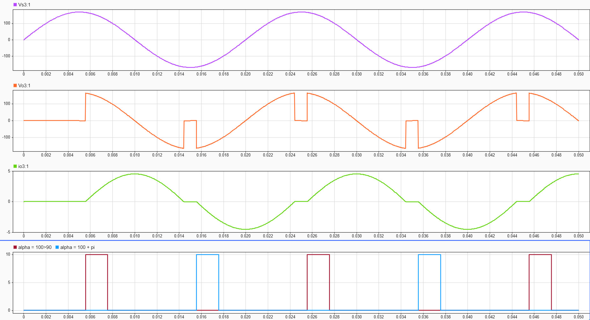

Name: Sovan Chhorponn

ID: e20220873

#HOMEWORK
---

## AC-to-AC Power Control Analysis (RMS Voltage)

### Single phase AC voltage controllers of a resistor load (Unidirectional)

The graphical results after simulation:

Input Voltage:
$$V_s(\omega t) = V_m \sin(\omega t)$$

The RMS output voltage $$V_{rms}$$ is calculated by integrating the squared voltage over a full cycle $$2\pi$$:

$$V_{rms} = \sqrt{\frac{1}{2\pi} \left[ \int_{\alpha}^{\pi} V_m^2 \sin^2(\omega t) \, d(\omega t) + \int_{\pi}^{2\pi} V_m^2 \sin^2(\omega t) \, d(\omega t) \right]}$$

Using the trigonometric identity $$\sin^2(\omega t) = \frac{1 - \cos(2\omega t)}{2}$$:

$$V_{rms} = \sqrt{\frac{V_m^2}{2\pi} \left[ \int_{\alpha}^{\pi} \frac{1 - \cos(2\omega t)}{2} \, d(\omega t) + \int_{\pi}^{2\pi} \frac{1 - \cos(2\omega t)}{2} \, d(\omega t) \right]}$$

$$V_{rms} = \sqrt{\frac{V_m^2}{4\pi} \left[ \left[ \omega t - \frac{\sin(2\omega t)}{2} \right]_{\alpha}^{\pi} + \left[ \omega t - \frac{\sin(2\omega t)}{2} \right]_{\pi}^{2\pi} \right]}$$

Evaluating the limits:

$$\left[ \omega t - \frac{\sin(2\omega t)}{2} \right]_{\alpha}^{\pi} = (\pi - 0) - \left( \alpha - \frac{\sin(2\alpha)}{2} \right) = \pi - \alpha + \frac{\sin(2\alpha)}{2}$$

$$\left[ \omega t - \frac{\sin(2\omega t)}{2} \right]_{\pi}^{2\pi} = (2\pi - 0) - (\pi - 0) = \pi$$

Combining the terms:

$$ V_{rms} = \sqrt{\frac{V_m^2}{4\pi} \left[ \pi - \alpha + \frac{\sin(2\alpha)}{2} + \pi \right]} $$

$$ V_{rms} = \frac{V_m}{2} \sqrt{\frac{1}{\pi} \left( 2\pi - \alpha + \frac{\sin(2\alpha)}{2} \right)} $$

---

### Single phase AC voltage controllers of a resistor load (Bidirectional)

The graphical results after simulation:

For a fully controlled configuration with a symmetric firing angle $$\alpha$$ for the forward thyristor and $$\pi + \alpha$$ for the reverse thyristor:

$$ V_{rms} = \sqrt{\frac{1}{2\pi} \left[ \int_{\alpha}^{\pi} V_m^2 \sin^2(\omega t) \, d(\omega t) + \int_{\pi+\alpha}^{2\pi} V_m^2 \sin^2(\omega t) \, d(\omega t) \right]} $$

Due to half-wave symmetry, the energy content of both intervals is identical:

$$ V_{rms} = \sqrt{\frac{2}{2\pi} \int_{\alpha}^{\pi} V_m^2 \sin^2(\omega t) \, d(\omega t)} $$

$$ V_{rms} = \sqrt{\frac{V_m^2}{\pi} \int_{\alpha}^{\pi} \frac{1 - \cos(2\omega t)}{2} \, d(\omega t)} $$

$$ V_{rms} = \sqrt{\frac{V_m^2}{2\pi} \left[ \omega t - \frac{\sin(2\omega t)}{2} \right]_{\alpha}^{\pi} } $$

$$ V_{rms} = \sqrt{\frac{V_m^2}{2\pi} \left( \pi - \alpha + \frac{\sin(2\alpha)}{2} \right)} $$

$$ V_{rms} = \frac{V_m}{\sqrt{2}} \sqrt{\frac{1}{\pi} \left( \pi - \alpha + \frac{\sin(2\alpha)}{2} \right)} $$

---

### Single phase AC voltage controllers of an inductor load (Bidirectional)

#### - $$alpha < 90 \degree $$ 

The graphical results after simulation:

Applying Kirchhoff's Voltage Law (KVL) during conduction:

$$V_m \sin(\omega t) = L \frac{di}{dt} = L\omega \frac{di}{d(\omega t)}$$

$$di = \frac{V_m}{\omega L} \sin(\omega t) \, d(\omega t)$$

Integrating from the firing angle $$\alpha$$ to find the current profile:

$$i(\omega t) = \frac{V_m}{\omega L} \int_{\alpha}^{\omega t} \sin(\theta) \, d\theta = \frac{V_m}{\omega L} \left( \cos\alpha - \cos(\omega t) \right)$$

The current extinction angle $$\beta $$ occurs when $$ i(\beta) = 0$$ :

$$\cos\alpha - \cos\beta = 0 \implies \beta = 2\pi - \alpha$$

The total conduction angle is:

$$\gamma = \beta - \alpha = 2(\pi - \alpha)$$

When the firing angle is $$\alpha < 90^\circ$$ ($$\alpha < \frac{\pi}{2}$$) :

$$\gamma = 2\left(\pi - \alpha\right) > \pi$$

Because the conduction angle exceeds $$\pi$$ , the forward thyristor remains conducting when the reverse thyristor receives its gate pulse at $$\pi + \alpha$$ . This results in continuous conduction, causing a complete loss of phase control. The load is permanently connected directly across the AC supply.

Consequently, the output voltage matches the input waveform continuously:

$$V_{rms} = \frac{V_m}{\sqrt{2}}$$

---

#### - $$alpha > 90 \degree $$

The graphical results after simulation:

Applying KVL for proper discontinuous operation:

$$V_m \sin(\omega t) = L \frac{di}{dt}$$

When the firing angle is $$\alpha > 90^\circ$$ ( $$\alpha > \frac{\pi}{2}$$ ):

$$\gamma = 2(\pi - \alpha) < \pi$$

The current drops back to zero naturally before the opposing thyristor fires ( $$\beta < \pi + \alpha$$ ), maintaining independent control of each half-cycle. 

The output voltage follows the input line voltage exclusively during the conduction periods from $$\alpha$$ to $$2\pi - \alpha$$ across a semi-cycle period of $$\pi$$ :

$$V_{rms} = \sqrt{\frac{1}{\pi} \int_{\alpha}^{2\pi - \alpha} V_m^2 \sin^2(\omega t) \, d(\omega t)}$$

$$V_{rms} = \sqrt{\frac{V_m^2}{\pi} \int_{\alpha}^{2\pi - \alpha} \frac{1 - \cos(2\omega t)}{2} \, d(\omega t)}$$

$$V_{rms} = \sqrt{\frac{V_m^2}{2\pi} \left[ \omega t - \frac{\sin(2\omega t)}{2} \right]_{\alpha}^{2\pi - \alpha}}$$

Evaluating boundaries:

$$\left[ \omega t - \frac{\sin(2\omega t)}{2} \right]_{\alpha}^{2\pi - \alpha} = \left( 2\pi - \alpha - \frac{\sin(4\pi - 2\alpha)}{2} \right) - \left( \alpha - \frac{\sin(2\alpha)}{2} \right)$$

Using the identity $$\sin(4\pi - 2\alpha) = -\sin(2\alpha)$$:

$$= 2\pi - 2\alpha + \frac{\sin(2\alpha)}{2} + \frac{\sin(2\alpha)}{2} = 2\pi - 2\alpha + \sin(2\alpha)$$

Substituting back into the RMS formula:

$$V_{rms} = \sqrt{\frac{V_m^2}{2\pi} \left( 2\pi - 2\alpha + \sin(2\alpha) \right)}$$

$$V_{rms} = V_m \sqrt{\frac{1}{\pi} \left( \pi - \alpha + \frac{\sin(2\alpha)}{2} \right)}$$

---

