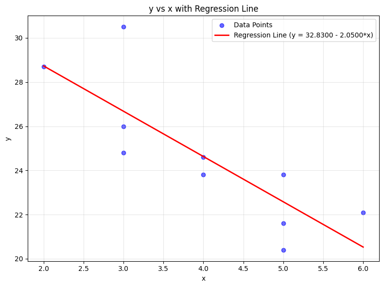

# Final Preparation
- [Final Preparation](#final-preparation)
  - [Exercise 1.](#exercise-1)
    - [Solution - 1](#solution---1)
  - [Exercise 2.](#exercise-2)
    - [Solution - 2](#solution---2)
  - [Exercise 3.](#exercise-3)
    - [Solution - 3](#solution---3)
  - [Exercise 4](#exercise-4)
    - [Solution - 4](#solution---4)
  - [Exercise 5](#exercise-5)
    - [Solution - 5](#solution---5)
  - [Exercise 6](#exercise-6)
    - [Solution - 6](#solution---6)
- [Statistical Tables](#statistical-tables)
  - [F-Distribution Table](#f-distribution-table)
    - [$df\_2 = 1$ to $10$](#df_2--1-to-10)

 ---
 ---

## Exercise 1. 
The following table is a partial ANOVA Table

| Source | Sum of Squares | df | Mean Square | F |
|---|---|---|---|---|
| Treatment | | 2 | | |
| Error | | | 20 | |
| Total | 500 | 11 | | |

Complete the table and answer the following questions. Use the $$\alpha = 0.05$$ significance level.

a. How many treatments are there?

b. What is the total sample size?

c. What is the critical value of $$F$$?

d. Write out the null and alternative hypotheses.

e. What is your conclusion regarding the null hypothesis?

---

### Solution - 1

The Completed ANOVA Table

To complete the table, we use the following relationships:

1. Degrees of Freedom for Error $$(df_{Error})$$: $$df_{Total} - df_{Treatment} = 11 - 2 = 9$$
2. Sum of Squares for Error (SSE): $$MSE \times df_{Error} = 20 \times 9 = 180$$
3. Sum of Squares for Treatment (SST): $$SSTotal - SSE = 500 - 180 = 320$$
4. Mean Square for Treatment (MST): $$SST / df_{Treatment} = 320 / 2 = 160$$
5. F-statistic (F): $$MST / MSE = 160 / 20 = 8.00$$

| Source | Sum of Squares | df | Mean Square | F |
|---|---|---|---|---|
| **Treatment** | 320 | 2 | 160 | 8.00 |
| **Error** | 180 | 9 | 20 | |
| **Total** | 500 | 11 | | |

**a. How many treatments are there?**

The degrees of freedom for treatment is $$k - 1$$, where $$k$$ is the number of treatments.
$$2 = k - 1 \implies k = 3$$
There are 3 treatments.

**b. What is the total sample size?**

The total degrees of freedom is $$n - 1$$, where $$n$$ is the total sample size.
$$11 = n - 1 \implies n = 12$$
The total sample size is 12.

**c. What is the critical value of F?**

Using the F-distribution table with $$\alpha = 0.05$$, numerator $$df = 2$$, and denominator $$df = 9$$:
$$F_{0.05}(2, 9) \approx 4.26$$

**d. Write out the null and alternative hypotheses.**

* $$H_0: \mu_1 = \mu_2 = \mu_3$$ (The means of all treatments are equal)
* $$H_1$$: At least one treatment mean is different from the others.

**e. What is your conclusion regarding the null hypothesis?**

We compare the calculated F-statistic to the critical value:

* Calculated $$F$$: 8.00
* Critical $$F$$: 4.26

Since the calculated $$F$$: 8.00 is greater than the critical value $$(4.26)$$, we reject the null hypothesis. There is sufficient evidence at the 0.05 significance level to conclude that there is a significant difference between the treatment means.

---
---

## Exercise 2. 

The results of a one-way ANOVA are reported below.

| Source of Variation | SS | df | MS | F |
| :--- | :--- | :--- | :--- | :--- |
| Between Groups | 6.90 | 2 | 3.45 | 5.15 |
| Within Groups | 12.04 | 18 | 0.67 | |
| Total | 18.94 | 20 | | |

Answer the following questions.

a. How many treatments are in the study?

b. What is the total sample size?

c. What is the critical value of $$F$$? (Using $$\alpha = 0.05$$)

d. Write out the null hypothesis and the alternative hypothesis.

e. What is your decision regarding the null hypothesis?

f. Can we conclude that any of the treatment means differ?

---

### Solution - 2

**a. How many treatments are in the study?**

The degrees of freedom for Between Groups is $$k - 1$$, where $$k$$ is the number of treatments (groups).
$$2 = k - 1 \implies k = 3$$
There are 3 treatments in the study.

**b. What is the total sample size?**

The total degrees of freedom is $$n - 1$$, where $$n$$ is the total sample size.
$$20 = n - 1 \implies n = 21$$
The total sample size is 21.

**c. What is the critical value of $$F$$?**

Using an F-distribution table with $$\alpha = 0.05$$, numerator degrees of freedom ($$df_{Between}$$) = 2, and denominator degrees of freedom ($$df_{Within}$$) = 18:
$$F_{0.05}(2, 18) = 3.55$$

**d. Write out the null hypothesis and the alternative hypothesis.**

* $$H_0$$: $$\mu_1 = \mu_2 = \mu_3$$ (The means of all treatments are equal)
* $$H_1$$: At least one treatment mean is different from the others.

**e. What is your decision regarding the null hypothesis?**

We compare the calculated F-statistic from the table to the critical value:
* Calculated $$F$$: 5.15
* Critical $$F$$: 3.55

Since the calculated $$F (5.15)$$ is greater than the critical value $$(3.55)$$, we reject the null hypothesis.

**f. Can we conclude that any of the treatment means differ?**

Yes. Because we rejected the null hypothesis, there is sufficient evidence at the 0.05 significance level to conclude that there is a statistically significant difference between at least two of the treatment means.

---
---

## Exercise 3. 
**Fuel Efficiency ANOVA Analysis**

The fuel efficiencies for a sample of 27 compact, midsize, and large cars are analyzed using ANOVA to investigate whether there is a difference in the mean miles per gallon (MPG) for the three car sizes.

Significance Level: $$\alpha = 0.01$$

**Summary Statistics**
| Group | Sample Size | Sum | Average | Variance |
| :--- | :--- | :--- | :--- | :--- |
| Compact | 12 | 268.3 | 22.35833 | 9.388106 |
| Midsize | 9 | 172.4 | 19.15556 | 7.315278 |
| Large | 6 | 100.5 | 16.75 | 7.303 |

**ANOVA Table**
| Source of Variation | SS | df | MS | F | p-value |
| :--- | :--- | :--- | :--- | :--- | :--- |
| Between Groups | 136.4803 | 2 | 68.24014 | 8.258752 | 0.001866 |
| Within Groups | 198.3064 | 24 | 8.262766 | | |
| Total | 334.7867 | 26 | | | |

---

### Solution - 3

**A. State the null hypothesis and the alternative hypothesis.**

* **$$H_0$$:** $$\mu_{Compact} = \mu_{Midsize} = \mu_{Large}$$ (The mean fuel efficiency is the same for all three car sizes)
* **$$H_1$$:** At least one of the mean fuel efficiencies is different from the others.

**B. What is the value of the test statistic $$F$$?**

From the ANOVA table provided:
$$F = 8.258752$$

**C. What is the $$p$$-value?**

From the ANOVA table provided:
$$p\text{-value} = 0.001866$$

**D. State the decision rule at the $$\alpha = 0.01$$ level.**

The decision rule for a $$p$$-value approach is:
* Reject $$H_0$$ if $$p\text{-value} \le \alpha$$
* Fail to reject $$H_0$$ if $$p\text{-value} > \alpha$$

In this case: Reject $$H_0$$ if $$0.001866 \le 0.01$$ .

(Alternatively, using the critical value approach: For $$df_1 = 2, df_2 = 24$$ at $$\alpha = 0.01$$, the critical $$F$$ is approximately $$5.61$$. We reject $$H_0$$ if $$F_{calculated} > 5.61$$).

**E. What is your conclusion regarding the mean miles per gallon for the three car sizes?**

Since the $$p\text{-value} (0.001866)$$ is less than the significance level $$\alpha (0.01)$$, we reject the null hypothesis.

Thus, there is sufficient evidence at the 0.01 significance level to conclude that there is a statistically significant difference in the mean fuel efficiency (miles per gallon) between compact, midsize, and large cars.

---
---

## Exercise 4

The *Mozart effect* refers to a boost of average performance on tests for elementary school students if the students listen to Mozart's chamber music for a period of time immediately before the test. Many educators believe that such an effect is not necessarily due to Mozart's music *per se* but rather to a relaxation period before the test.

To support this belief, an elementary school teacher conducted an experiment by dividing her third-grade class of 15 students into three groups of 5 students each:

* **Group 1:** Self-administered facial massage before the test.
* **Group 2:** Listened to Mozart's chamber music for 15 minutes before the test.
* **Group 3:** Listened to Schubert's chamber music for 15 minutes before the test.

The test scores of the 15 students are given below:

| Group 1 | Group 2 | Group 3 |
| :---: | :---: | :---: |
| 79 | 82 | 80 |
| 81 | 84 | 81 |
| 80 | 86 | 71 |
| 89 | 91 | 90 |
| 86 | 82 | 86 |

Using the one-way ANOVA $$F$$-test at the $$10\%$$ level of significance, answer the following questions:

a. How many treatments are in the study?

b. What is the total sample size?

c. What is the critical value of $$F$$?

d. Write out the null hypothesis and the alternative hypothesis.

e. What is your decision regarding the null hypothesis?

f. Does the data provide sufficient evidence to conclude that any of the three relaxation methods performs better than the others?

---

### Solution - 4

**Completed ANOVA Table**

First, we calculate the necessary sums and means:
* **Group 1 Mean ($$\bar{x}_1$$):** $$83.0$$
* **Group 2 Mean ($$\bar{x}_2$$):** $$85.0$$
* **Group 3 Mean ($$\bar{x}_3$$):** $$81.6$$
* **Grand Mean ($$\bar{x}_G$$):** $$83.2$$

**Calculations:**
1.  **$$SS_{Between}$$:** $$5 \times [(83.0 - 83.2)^2 + (85.0 - 83.2)^2 + (81.6 - 83.2)^2] = 29.20$$
2.  **$$SS_{Within}$$:** Sum of squared deviations within each group = $$335.20$$
3.  **$$MS_{Between}$$:** $$SS_{Between} / df_{Between} = 29.20 / 2 = 14.60$$
4.  **$$MS_{Within}$$:** $$SS_{Within} / df_{Within} = 335.20 / 12 \approx 27.933$$
5.  **$$F$$-statistic:** $$14.60 / 27.933 \approx 0.523$$

| Source of Variation | Sum of Squares | df | Mean Square | F |
| :--- | :--- | :--- | :--- | :--- |
| Between Groups | 29.20 | 2 | 14.60 | 0.523 |
| Within Groups | 335.20 | 12 | 27.93 | |
| **Total** | 364.40 | 14 | | |

**Answers to Questions**

**a. How many treatments are in the study?**

There are 3 treatments (Group 1, Group 2, and Group 3).

**b. What is the total sample size?**

There are 5 students in each of the 3 groups, so $$n = 15$$.

**c. What is the critical value of $$F$$?**

Using the F-distribution table with $$\alpha = 0.10$$, numerator $$df = 2$$, and denominator $$df = 12$$:
$$F_{0.10}(2, 12) \approx 2.81$$

**d. Write out the null hypothesis and the alternative hypothesis.**
* $$H_0$$: $$\mu_1 = \mu_2 = \mu_3$$ (The mean test scores are equal for all relaxation methods)
* $$H_1$$: At least one treatment mean is different from the others.

**e. What is your decision regarding the null hypothesis?**
Compare the calculated $$F$$ to the critical value:
* Calculated $$F$$: $$0.523$$
* Critical $$F$$: $$2.81$$

Since the calculated $$F (0.523)$$ is less than the critical value $$(2.81)$$, we fail to reject the null hypothesis.

**f. Does the data provide sufficient evidence to conclude that any of the three relaxation methods performs better than the others?**

No. At the $$10\%$$ significance level, there is not enough evidence to conclude that there is a significant difference in performance between the relaxation methods.

---
---

## Exercise 5

Answer the following questions regarding linear regression assumptions and exploratory data analysis:

5.1. How can a data professional determine whether the linearity assumption is met in a linear regression model?

5.2. When and how can a data professional check the normality assumption in a regression model?

5.3. A data professional uses a scatterplot to plot residuals and predicted values from a regression model to check for homoscedasticity and finds that this assumption is met. What shape do the points in the scatterplot appear as?

5.4. What is the purpose of using a scatterplot matrix in exploratory data analysis?

---

### Solution - 5

**5.1. How can a data professional determine whether the linearity assumption is met in a linear regression model?**

A data professional can determine linearity by creating a **Residuals vs. Fitted plot** (a scatterplot with residuals on the y-axis and predicted/fitted values on the x-axis). If the points are randomly scattered around the horizontal zero line without forming any clear curve or systematic pattern, the linearity assumption is met.

**5.2. When and how can a data professional check the normality assumption in a regression model?**

The normality assumption is checked after fitting the model by examining the distribution of the residuals (not the raw data). It can be checked using:

 * **Normal Q-Q Plot:** If the points lie approximately along a straight diagonal line, the assumption is met.

 * **Histogram of Residuals:** To visually inspect for a bell-shaped (normal) curve.

 * **Statistical Tests:** Such as the Shapiro-Wilk test or the Kolmogorov-Smirnov test.

**5.3. A data professional uses a scatterplot to plot residuals and predicted values from a regression model to check for homoscedasticity and finds that this assumption is met. What shape do the points in the scatterplot appear as?**

When the homoscedasticity assumption is met, the points appear as a random, uniform cloud or a constant-width rectangular band. There should be no "fan" or "funnel" shape, meaning the spread of the residuals remains consistent across all predicted values.

**5.4. What is the purpose of using a scatterplot matrix in exploratory data analysis?**

The purpose of a scatterplot matrix is to visualize the pairwise relationships between multiple numerical variables in a dataset at once. It allows the professional to quickly identify correlations, potential linear or non-linear patterns, and outliers across all variable combinations in a single view.

---
---

## Exercise 6

The table shows the age in years and the retail value in thousands of dollars of a random sample of ten automobiles of the same make and model.

| x | 2 | 3 | 3 | 3 | 4 | 4 | 5 | 5 | 5 | 6 |
|---|---|---|---|---|---|---|---|---|---|---|
| y | 28.7 | 24.8 | 26.0 | 30.5 | 23.8 | 24.6 | 23.8 | 20.4 | 21.6 | 22.1 |

6.1. Construct the scatter diagram.

6.2. Compute the linear correlation coefficient *r*. Interpret its value in the context of the problem.

6.3. Compute the least squares regression line. Plot it on the scatter diagram.

6.4. Interpret the meaning of the slope of the least squares regression line in the context of the problem.

6.5. Suppose a four-year-old automobile of this make and model is selected at random. Use the regression equation to predict its retail value.

6.6. Suppose a 20-year-old automobile of this make and model is selected at random. Use the regression equation to predict its retail value. Interpret the result.

6.7. Comment on the validity of using the regression equation to predict the price of a brand new automobile of this make and model.

---

### Solution - 6

**6.1. Construct the scatter diagram.**

**6.2. Compute the linear correlation coefficient *r*. Interpret its value in the context of the problem.**

First, compute the necessary sums from the data (n = 10):

- Σx = 2 + 3 + 3 + 3 + 4 + 4 + 5 + 5 + 5 + 6 = **40**
- Σy = 28.7 + 24.8 + 26.0 + 30.5 + 23.8 + 24.6 + 23.8 + 20.4 + 21.6 + 22.1 = **246.3**
- Σx² = 4 + 9 + 9 + 9 + 16 + 16 + 25 + 25 + 25 + 36 = **174**
- Σy² = 823.69 + 615.04 + 676.0 + 930.25 + 566.44 + 605.16 + 566.44 + 416.16 + 466.56 + 488.41 = **6154.15**
- Σxy = 57.4 + 74.4 + 78.0 + 91.5 + 95.2 + 98.4 + 119.0 + 102.0 + 108.0 + 132.6 = **956.5**

Using the formula:

$$r = \frac{n\Sigma xy - (\Sigma x)(\Sigma y)}{\sqrt{[n\Sigma x^2 - (\Sigma x)^2][n\Sigma y^2 - (\Sigma y)^2]}}$$

$$r = \frac{10(956.5) - (40)(246.3)}{\sqrt{[10(174) - (40)^2][10(6154.15) - (246.3)^2]}}$$

$$r = \frac{9565 - 9852}{\sqrt{[1740 - 1600][61541.5 - 60663.69]}} = \frac{-287}{\sqrt{140 \times 877.81}} = \frac{-287}{\sqrt{122893.4}} \approx \frac{-287}{350.56} \approx \mathbf{-0.819}$$

**Interpretation:** The value r ≈ −0.819 indicates a strong negative linear correlation between the age of the automobile and its retail value. This means that as the age of the automobile increases, its retail value tends to decrease significantly.

**6.3. Compute the least squares regression line. Plot it on the scatter diagram.**

The regression line has the form ŷ = b₁x + b₀, where:

$$b_1 = \frac{n\Sigma xy - (\Sigma x)(\Sigma y)}{n\Sigma x^2 - (\Sigma x)^2} = \frac{-287}{140} \approx -2.050$$

$$b_0 = \bar{y} - b_1\bar{x} = \frac{246.3}{10} - (-2.050)\frac{40}{10} = 24.63 + 8.20 = 32.83$$

**Regression line: ŷ = −2.050x + 32.83**

To plot the line, substitute two x-values, such as x = 2 and x = 6, compute the corresponding ŷ values, and draw a straight line through those two points on the scatter diagram.

**6.4. Interpret the meaning of the slope of the least squares regression line in the context of the problem.**

The slope b₁ ≈ −2.050 means that for each additional year of age, the predicted retail value of an automobile of this make and model decreases by approximately $2,050(since y is measured in thousands of dollars). In other words, on average, the car loses about $2,050 in retail value per year.

**6.5. Suppose a four-year-old automobile of this make and model is selected at random. Use the regression equation to predict its retail value.**

Substituting x = 4 into the regression equation:

$$\hat{y} = -2.050(4) + 32.83 = -8.20 + 32.83 = 24.63$$

The predicted retail value of a four-year-old automobile of this make and model is approximately $24,630.

**6.6. Suppose a 20-year-old automobile of this make and model is selected at random. Use the regression equation to predict its retail value. Interpret the result.**

Substituting x = 20 into the regression equation:

$$\hat{y} = -2.050(20) + 32.83 = -41.00 + 32.83 = -8.17$$

The regression equation predicts a retail value of approximately −$8,170, which is not meaningful because a retail value cannot be negative. This result occurs because x = 20 is far outside the range of the observed data (ages 2–6), and extrapolating the linear model beyond the data range produces unreliable and nonsensical predictions.

**6.7. Comment on the validity of using the regression equation to predict the price of a brand new automobile of this make and model.**

A brand new automobile corresponds to x = 0, which is outside the range of the sample data (ages 2–6). Using the regression equation to predict at x = 0 is an example of extrapolation, which is generally not reliable. The linear relationship observed between ages 2 and 6 may not hold for a new vehicle. Therefore, the prediction would be of questionable validity, and the regression equation should not be used to estimate the price of a brand new automobile of this make and model.

# Statistical Tables

## F-Distribution Table

$$\alpha = 0.05$$

> **How to use:** Find the critical value at the intersection of $df_1$ (numerator, columns) and $df_2$ (denominator, rows).
> Reject $H_0$ if $F\text{-statistic} > F\text{-critical}$.

### $df_2 = 1$ to $10$

| $df_2 \setminus df_1$ | 1 | 2 | 3 | 4 | 5 | 6 | 7 | 8 | 9 | 10 |
| :---: | ---: | ---: | ---: | ---: | ---: | ---: | ---: | ---: | ---: | ---: |
| **1** | 161.45 | 199.50 | 215.71 | 224.58 | 230.16 | 233.99 | 236.77 | 238.88 | 240.54 | 241.88 |
| **2** | 18.51 | 19.00 | 19.16 | 19.25 | 19.30 | 19.33 | 19.35 | 19.37 | 19.38 | 19.40 |
| **3** | 10.13 | 9.55 | 9.28 | 9.12 | 9.01 | 8.94 | 8.89 | 8.85 | 8.81 | 8.79 |
| **4** | 7.71 | 6.94 | 6.59 | 6.39 | 6.26 | 6.16 | 6.09 | 6.04 | 6.00 | 5.96 |
| **5** | 6.61 | 5.79 | 5.41 | 5.19 | 5.05 | 4.95 | 4.88 | 4.82 | 4.77 | 4.74 |
| **6** | 5.99 | 5.14 | 4.76 | 4.53 | 4.39 | 4.28 | 4.21 | 4.15 | 4.10 | 4.06 |
| **7** | 5.59 | 4.74 | 4.35 | 4.12 | 3.97 | 3.87 | 3.79 | 3.73 | 3.68 | 3.64 |
| **8** | 5.32 | 4.46 | 4.07 | 3.84 | 3.69 | 3.58 | 3.50 | 3.44 | 3.39 | 3.35 |
| **9** | 5.12 | 4.26 | 3.86 | 3.63 | 3.48 | 3.37 | 3.29 | 3.23 | 3.18 | 3.14 |
| **10** | 4.96 | 4.10 | 3.71 | 3.48 | 3.33 | 3.22 | 3.14 | 3.07 | 3.02 | 2.98 |
| **11** | 4.84 | 3.98 | 3.59 | 3.36 | 3.20 | 3.09 | 3.01 | 2.95 | 2.90 | 2.85 |
| **12** | 4.75 | 3.89 | 3.49 | 3.26 | 3.11 | 3.00 | 2.91 | 2.85 | 2.80 | 2.75 |
| **13** | 4.67 | 3.81 | 3.41 | 3.18 | 3.03 | 2.92 | 2.83 | 2.77 | 2.71 | 2.67 |
| **14** | 4.60 | 3.74 | 3.34 | 3.11 | 2.96 | 2.85 | 2.76 | 2.70 | 2.65 | 2.60 |
| **15** | 4.54 | 3.68 | 3.29 | 3.06 | 2.90 | 2.79 | 2.71 | 2.64 | 2.59 | 2.54 |
| **16** | 4.49 | 3.63 | 3.24 | 3.01 | 2.85 | 2.74 | 2.66 | 2.59 | 2.54 | 2.49 |
| **17** | 4.45 | 3.59 | 3.20 | 2.96 | 2.81 | 2.70 | 2.61 | 2.55 | 2.49 | 2.45 |
| **18** | 4.41 | 3.55 | 3.16 | 2.93 | 2.77 | 2.66 | 2.58 | 2.51 | 2.46 | 2.41 |
| **19** | 4.38 | 3.52 | 3.13 | 2.90 | 2.74 | 2.63 | 2.54 | 2.48 | 2.42 | 2.38 |
| **20** | 4.35 | 3.49 | 3.10 | 2.87 | 2.71 | 2.60 | 2.51 | 2.45 | 2.39 | 2.35 |
| **21** | 4.32 | 3.47 | 3.07 | 2.84 | 2.68 | 2.57 | 2.49 | 2.42 | 2.37 | 2.32 |
| **22** | 4.30 | 3.44 | 3.05 | 2.82 | 2.66 | 2.55 | 2.46 | 2.40 | 2.34 | 2.30 |
| **23** | 4.28 | 3.42 | 3.03 | 2.80 | 2.64 | 2.53 | 2.44 | 2.37 | 2.32 | 2.27 |
| **24** | 4.26 | 3.40 | 3.01 | 2.78 | 2.62 | 2.51 | 2.42 | 2.36 | 2.30 | 2.25 |
| **25** | 4.24 | 3.39 | 2.99 | 2.76 | 2.60 | 2.49 | 2.40 | 2.34 | 2.28 | 2.24 |
| **26** | 4.23 | 3.37 | 2.98 | 2.74 | 2.59 | 2.47 | 2.39 | 2.32 | 2.27 | 2.22 |
| **27** | 4.21 | 3.35 | 2.96 | 2.73 | 2.57 | 2.46 | 2.37 | 2.31 | 2.25 | 2.20 |
| **28** | 4.20 | 3.34 | 2.95 | 2.71 | 2.56 | 2.45 | 2.36 | 2.29 | 2.24 | 2.19 |
| **29** | 4.18 | 3.33 | 2.93 | 2.70 | 2.55 | 2.43 | 2.35 | 2.28 | 2.22 | 2.18 |
| **30** | 4.17 | 3.32 | 2.92 | 2.69 | 2.53 | 2.42 | 2.33 | 2.27 | 2.21 | 2.16 |

---
